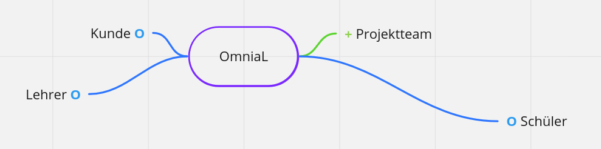

= Projekt ITP
1.0.0, {docdate}: ITP
//:toc-placement!:  // prevents the generation of the doc at this position, so it can be printed afterwards
:sourcedir: ../src/main/java
:icons: font
:sectnums:    // Nummerierung der Überschriften / section numbering
:toc: left
:experimental:

== Umfeldanalyse

=== Matrix zum Eintragen der Faktoren
|======
|*Einflussgröße* | *Sachlich/Sozial* | *Einfluss auf Projekt* | *Einstellung zum Projekt*
|Projektteam | sozial | hoch | positiv
|Kunde | sozial | hoch | neutral
|Schnittstellen | sachlich | hoch |
|Lehrer | sozial | mittel | neutral
|Schüler | sozial | gering | neutral
|======

=== Grafische Darstellung

